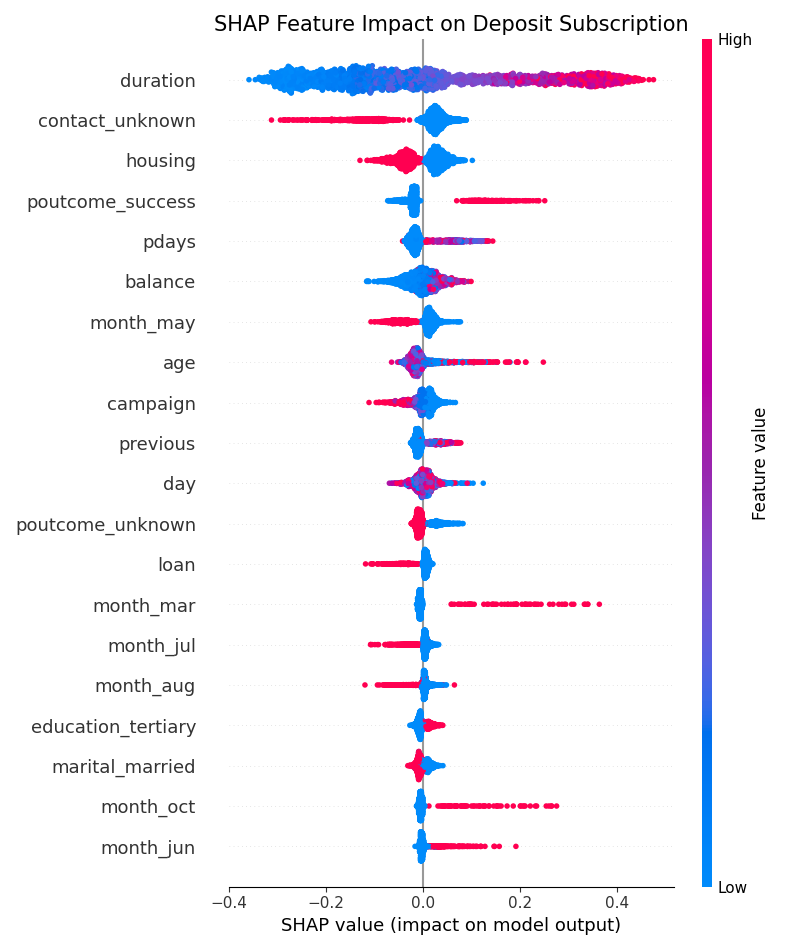
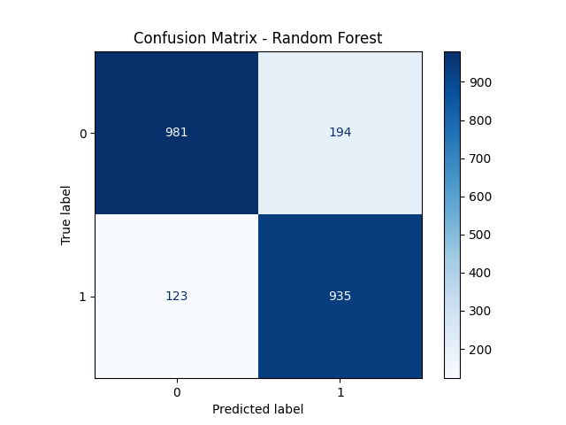
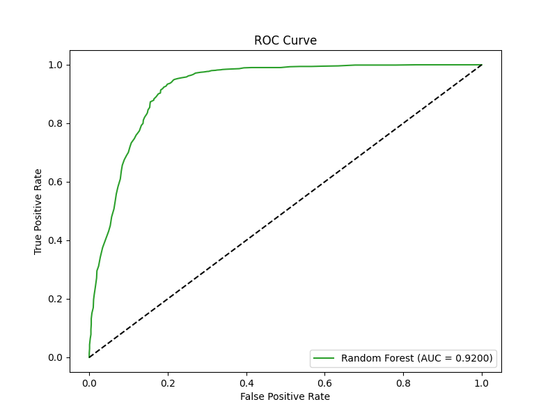

# Bank Marketing: Term Deposit Subscription Prediction

## Introduction
This project aims to predict whether a customer will subscribe to a term deposit (a "deposit") based on bank marketing campaign data. By leveraging machine learning, we can identify high-potential customers to optimize marketing resources and increase conversion rates.

## Key Findings
Through exploratory data analysis and model interpretation (SHAP), we identified the most influential factors:
- **Duration**: The length of the last contact call is the strongest predictor. Longer conversations significantly correlate with higher subscription rates.
- **Balance**: Customers with higher annual average balances show a greater tendency to invest in term deposits.
- **Poutcome**: Previous successful outcomes from earlier campaigns are highly indicative of future success.

## Business Impact
We implemented a priority-based action system derived from model probabilities:
- **High Priority (>70%)**: Recommended for immediate direct contact.
- **Medium Priority (40% - 70%)**: Targeted for automated nurturing via email or SMS.
- **Low Priority (<40%)**: Withheld from calls to reduce operational costs and avoid customer fatigue.

Optimization leads to:
- **Increased ROI**: By focusing on high-probability leads.
- **Lower Costs**: Reduced unnecessary calls to low-potential customers.

## Visualizations
### Model Explanation (SHAP)

*Figure 1: SHAP values demonstrating the impact of each feature on the model's output.*

### Performance Evaluation

*Figure 2: Confusion Matrix for the Random Forest model.*


*Figure 3: ROC-AUC Curve demonstrating model sensitivity and specificity.*

## Technical Details
- **Algorithm**: Random Forest Classifier
- **Pre-processing**: One-hot encoding for categorical variables and binary mapping for indicators.
- **Interpretability**: SHAP for "Black Box" model transparency.

## How to Run
1. Install dependencies:
   ```bash
   pip install -r requirements.txt
   ```
2. Run the training and evaluation script:
   ```bash
   python model_training.py
   ```

## Data Source
The dataset utilized is the **Bank Marketing Data Set** from the [UCI Machine Learning Repository](https://archive.ics.uci.edu/ml/datasets/Bank+Marketing) or [Kaggle](https://www.kaggle.com/datasets/janiobachmann/bank-marketing-dataset).
